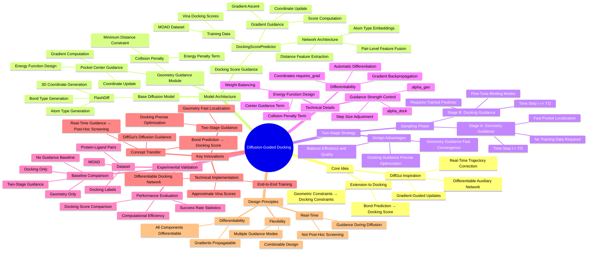
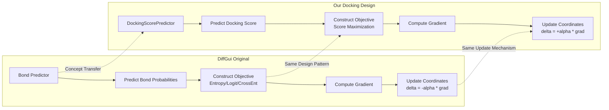

# Architecture Mindmap



## Architecture Flow

```mermaid
graph TB
    A[Input: Protein Pocket] --> B[Base Diffusion Model]
    B --> C[Diffusion Sampling Loop t=T→0]
    
    C --> D{Time Step t}
    D --> E[Standard Diffusion Update]
    E --> F[Predict x_{t-1}]
    
    F --> G{Guidance Strategy}
    G -->|Stage A: Geometry| H[Geometry Energy]
    G -->|Stage B: Docking| I[Docking Score]
    
    H --> H1[Pocket Center Energy]
    H --> H2[Collision Penalty]
    H1 --> H3[Gradient Computation]
    H2 --> H3
    H3 --> H4[Coordinate Update]
    
    I --> I1[DockingScorePredictor]
    I1 --> I2[Protein-Ligand Features]
    I2 --> I3[Distance Encoding RBF]
    I3 --> I4[Pair Feature Fusion]
    I4 --> I5[Pooling and Prediction]
    I5 --> I6[Docking Score]
    I6 --> I7[Gradient Ascent Update]
    
    H4 --> J[Updated x_{t-1}]
    I7 --> J
    
    J --> K{t > 0?}
    K -->|Yes| C
    K -->|No| L[Final Ligand Structure]
    
    L --> M[Docking Evaluation]
    M --> N[Output Results]
```

## DiffGui Comparison



